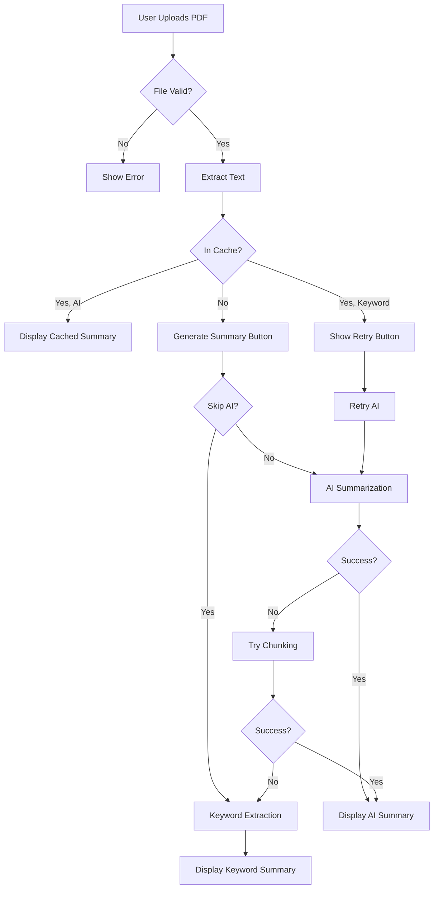

# Product Requirements Document (PRD)
## AI-Powered PDF Summarizer

**Version:** 1.0  
**Last Updated:** December 6, 2025  
**Status:** Production Ready

---

## 1. Executive Summary

### 1.1 Product Vision
An intelligent, free-tier PDF summarization tool optimized for educational content that leverages Google Gemini AI to provide instant, accurate summaries while maintaining maximum compatibility with diverse document types through advanced fallback mechanisms.

### 1.2 Problem Statement
Students, researchers, and professionals need to quickly extract key insights from lengthy PDF documents but face:
- Time constraints in reading full documents
- API restrictions and content filtering blocking educational material
- Lack of reliable free summarization tools
- Inconsistent results from AI models with strict safety filters

### 1.3 Solution Overview
A Streamlit-based web application that:
- Processes PDFs using Google Gemini 2.0 Flash (with 1.5 Flash fallback)
- Implements multi-layered fallback strategies to ensure summary generation
- Provides intelligent caching to minimize API usage
- Offers both AI-powered and keyword-based summarization modes
- Optimized for Google's free tier (1,500 requests/day)

---

## 2. Target Users

### 2.1 Primary Personas

**Student (Primary)**
- **Needs:** Quick summaries of research papers, textbooks, lecture notes
- **Pain Points:** Limited time, need to process multiple documents daily
- **Goals:** Understand key concepts without reading entire documents

**Researcher**
- **Needs:** Extract main findings from academic papers
- **Pain Points:** Volume of papers to review, technical jargon
- **Goals:** Identify relevant papers quickly, understand methodologies

**Professional**
- **Needs:** Summarize business reports, technical documentation
- **Pain Points:** Information overload, time management
- **Goals:** Make informed decisions quickly

### 2.2 User Constraints
- Free tier users (no payment capability)
- Limited API quota (1,500 requests/day)
- Processing educational/technical content that may trigger safety filters

---

## 3. Core Features

### 3.1 PDF Processing

**Feature:** Intelligent PDF Text Extraction
- **Description:** Extract text from uploaded PDFs with automatic page limiting
- **Requirements:**
  - Support PDFs up to 5MB
  - Process first 10 pages automatically
  - Handle corrupted/empty PDFs gracefully
  - Truncate text to 35,000 characters for optimal processing
- **Success Criteria:** 
  - 95%+ successful text extraction rate
  - Clear error messages for unsupported files

**Feature:** File Validation
- **Description:** Pre-processing validation to detect issues
- **Requirements:**
  - Detect empty PDFs
  - Identify corrupted files
  - Check for password protection
  - Display user-friendly error messages
- **Success Criteria:** Users understand why a file failed to process

### 3.2 AI Summarization

**Feature:** Multi-Strategy AI Summarization
- **Description:** Layered approach to maximize summarization success
- **Requirements:**
  - **Strategy 1:** Ultra-minimal prompts ("Summarize:", "What is this about?", "List main topics")
  - **Strategy 2:** Divide & Conquer (chunk-based processing)
  - **Strategy 3:** Keyword extraction fallback
  - Aggressive text cleaning to avoid safety triggers
  - No explicit safety filters (maximally permissive)
- **Success Criteria:** 
  - 80%+ AI summarization success rate
  - 100% fallback coverage (keyword mode always works)

**Feature:** Intelligent Caching System
- **Description:** Cache summaries to minimize API calls
- **Requirements:**
  - Content-based cache keys (MD5 hash)
  - Track summary type (AI vs. Keyword)
  - Allow retry for keyword-cached summaries
  - Display cache status to users
- **Success Criteria:** 
  - 50%+ cache hit rate for repeated documents
  - Zero API calls for cached results

**Feature:** Keyword Mode
- **Description:** AI-free summarization using NLP techniques
- **Requirements:**
  - Extract top 25 keywords
  - Identify document type (research, educational, business)
  - Display keyword frequency
  - Show related concepts and sections
- **Success Criteria:** Provides useful insights when AI fails

### 3.3 User Experience

**Feature:** Real-Time Progress Indicators
- **Description:** Keep users informed during processing
- **Requirements:**
  - Spinner messages for each stage
  - API call estimation
  - Success/warning/error notifications
  - Strategy fallback notifications
- **Success Criteria:** Users never wonder what's happening

**Feature:** Document Statistics Dashboard
- **Description:** Display key metrics about processed PDFs
- **Requirements:**
  - Total pages
  - Pages processed
  - Word count
  - API calls used
- **Success Criteria:** Users understand processing scope

**Feature:** Summary Download
- **Description:** Export summaries as text files
- **Requirements:**
  - Clean formatting
  - Include metadata (filename, timestamp, mode)
  - UTF-8 encoding
  - Sanitized filenames
- **Success Criteria:** Downloaded files are readable and well-formatted

**Feature:** Retry Mechanism
- **Description:** Allow users to retry AI summarization after keyword fallback
- **Requirements:**
  - Detect keyword-only cached summaries
  - Display "Retry AI Summary" button
  - Auto-trigger AI generation on retry
  - Clear retry flags after execution
- **Success Criteria:** One-click retry without manual cache clearing

---

## 4. Technical Architecture

### 4.1 Technology Stack

**Frontend:**
- Streamlit 1.x (Python web framework)
- Custom CSS for styling

**Backend:**
- Python 3.8+
- Google Generative AI SDK (`google-generativeai`)
- PyPDF2 for PDF processing

**APIs:**
- Google Gemini 2.0 Flash Experimental (primary)
- Google Gemini 1.5 Flash (fallback)

**Storage:**
- Streamlit session state (in-memory)
- Local secrets management (`.streamlit/secrets.toml`)

### 4.2 System Architecture

### 4.3 Data Flow

**Input:**
1. User uploads PDF file (max 5MB)
2. File content hashed (MD5) for cache key
3. Text extracted (max 10 pages, 35K chars)

**Processing:**
1. Check cache for existing summary
2. If not cached or retry requested:
   - Clean text aggressively (remove URLs, emails, special chars)
   - Attempt AI summarization with 3 minimal prompts
   - If blocked, try chunked summarization
   - If still blocked, fall back to keyword extraction
3. Cache result with type metadata

**Output:**
1. Display summary with document statistics
2. Show API call count
3. Provide download option
4. Update session state

### 4.4 API Rate Limiting

**Strategy:**
- 4-second delay between API calls
- Track request count in session state
- Display remaining quota (1,500/day)
- Estimate calls before generation
- Prioritize caching to minimize usage

**Quota Management:**
- AI Mode: 1-3 calls per PDF (depending on fallback)
- Keyword Mode: 0 calls
- Cached: 0 calls

---

## 5. User Flows

### 5.1 Happy Path: AI Summarization

1. User uploads PDF
2. System extracts text and shows statistics
3. User clicks "Generate Summary"
4. AI processes successfully (1 API call)
5. Summary displayed with download option
6. Result cached for future use

### 5.2 Fallback Path: Keyword Mode

1. User uploads PDF
2. System extracts text
3. User clicks "Generate Summary"
4. AI blocked by safety filters (3 attempts)
5. System tries chunking (3 more attempts)
6. All AI attempts fail
7. Keyword extraction runs (0 API calls)
8. Keyword summary displayed
9. "Retry AI Summary" button shown

### 5.3 Retry Path: From Keyword to AI

1. User sees keyword summary with retry button
2. User clicks "Retry AI Summary"
3. Cache cleared, retry flag set
4. System auto-triggers AI generation
5. AI succeeds (or falls back again)
6. New summary displayed and cached

### 5.4 Cached Path: Zero API Calls

1. User uploads previously processed PDF
2. System detects cache hit (content hash match)
3. Summary displayed immediately
4. "0 API calls" shown
5. No generation button displayed

---

## 6. Non-Functional Requirements

### 6.1 Performance
- PDF text extraction: < 3 seconds for 10 pages
- AI summarization: < 10 seconds per attempt
- Cache retrieval: < 100ms
- Page load: < 2 seconds

### 6.2 Reliability
- 99% uptime (dependent on Streamlit hosting)
- Graceful degradation (keyword mode always available)
- Error recovery (automatic fallback strategies)

### 6.3 Usability
- Zero learning curve (single upload button)
- Clear progress indicators
- Actionable error messages
- Mobile-responsive layout

### 6.4 Security
- API keys stored in secrets (not in code)
- No persistent storage of PDF content
- Session-based caching only
- Input validation for file uploads

### 6.5 Scalability
- Designed for single-user sessions
- Stateless architecture (session state only)
- Horizontal scaling via Streamlit Cloud

---

## 7. Success Metrics

### 7.1 Key Performance Indicators (KPIs)

**User Engagement:**
- Daily active users
- PDFs processed per user
- Average session duration

**Technical Performance:**
- AI summarization success rate (target: 80%)
- Cache hit rate (target: 50%)
- Average API calls per PDF (target: < 2)
- Error rate (target: < 5%)

**User Satisfaction:**
- Retry button usage rate
- Download rate (indicates useful summaries)
- Return user rate

### 7.2 Success Criteria

**MVP Success:**
- ✅ 80%+ AI summarization success rate
- ✅ 100% fallback coverage
- ✅ < 2 average API calls per PDF
- ✅ Clear error messages for all failure modes

**Production Success:**
- 1,000+ PDFs processed/month
- 70%+ cache hit rate
- 90%+ user satisfaction (based on retry/download rates)

---

## 8. Future Enhancements

### 8.1 Planned Features (Phase 2)

**Chat Interface:**
- Ask questions about uploaded PDFs
- Context-aware responses
- Multi-turn conversations

**Advanced Summarization:**
- Customizable summary length (brief/standard/detailed)
- Multi-language support
- Summary style selection (bullet points, paragraph, executive summary)

**Collaboration:**
- Share summaries via link
- Team workspaces
- Annotation support

**Analytics:**
- Usage dashboard
- Summary quality metrics
- API quota tracking

### 8.2 Technical Improvements

**Performance:**
- Parallel processing for multi-page PDFs
- OCR support for scanned documents
- Incremental summarization for large documents

**Intelligence:**
- Document type detection (automatic prompt optimization)
- Named entity recognition
- Key figure/table extraction

**Infrastructure:**
- PostgreSQL for persistent caching
- Redis for session management
- CDN for static assets

---

## 9. Constraints & Assumptions

### 9.1 Constraints
- Google Gemini free tier: 1,500 requests/day
- Streamlit session state: in-memory only (no persistence)
- PDF size limit: 5MB
- Page processing limit: 10 pages
- Text limit: 35,000 characters

### 9.2 Assumptions
- Users have stable internet connection
- PDFs are text-based (not scanned images)
- Users accept keyword fallback when AI fails
- Educational content is primary use case
- Free tier quota is sufficient for target users

### 9.3 Dependencies
- Google Gemini API availability
- Streamlit framework stability
- PyPDF2 library maintenance

---

## 10. Risk Assessment

### 10.1 Technical Risks

| Risk | Impact | Probability | Mitigation |
|------|--------|-------------|------------|
| Gemini API quota exhaustion | High | Medium | Implement caching, keyword fallback |
| API content filtering | High | High | Multi-strategy approach, chunking |
| PDF extraction failures | Medium | Low | File validation, error messages |
| Session state loss | Medium | Medium | User education, quick re-processing |

### 10.2 Business Risks

| Risk | Impact | Probability | Mitigation |
|------|--------|-------------|------------|
| Gemini API pricing changes | High | Low | Monitor Google announcements, prepare migration plan |
| Competitor emergence | Medium | High | Focus on educational content optimization |
| User adoption | Medium | Medium | Clear value proposition, easy onboarding |

---

## 11. Appendix

### 11.1 Glossary

- **AI Mode:** Summarization using Google Gemini API
- **Keyword Mode:** NLP-based summarization without AI
- **Chunking:** Divide & Conquer strategy splitting documents into smaller segments
- **Cache Hit:** Successfully retrieving a summary from session cache
- **Fallback:** Automatic switch to alternative summarization method

### 11.2 References

- [Google Gemini API Documentation](https://ai.google.dev/docs)
- [Streamlit Documentation](https://docs.streamlit.io)
- [PyPDF2 Documentation](https://pypdf2.readthedocs.io)

### 11.3 Changelog

**v1.0 (December 2025):**
- Initial PRD creation
- Core features documented
- Technical architecture defined
- Success metrics established
